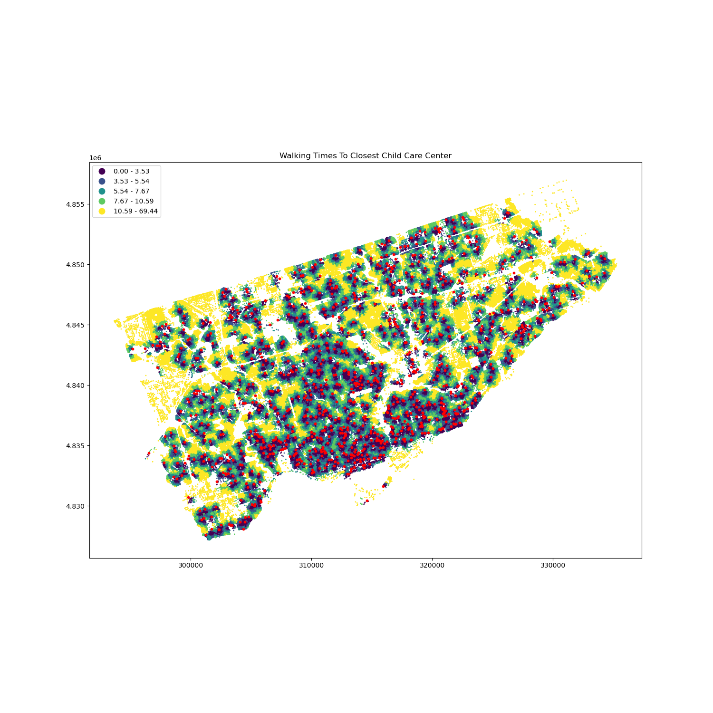

# Integrated Geographic Basemap

In this project, we use various publicly available datasets from the city of Toronto (https://open.toronto.ca/) to give users an impression about the general state of public services, features, and other points of interest and their accessibility.

In general our strategy has been to conceptualize the city as a network of nodes and edges that connect those nodes.

1. The nodes are addresses and points of interest (i.e. services, amenities,
important geographic features).

2. The edges are various networks depending on our purpose: roads, sidewalks,
pedestrian network, etc.

Once a network has been created in our coding environment we can use it to calculate distance between points of interest and transportation time between those points. The payoff is in visualizing the entire city as a heatmap showing the quantiles of travel time from POI to POI along the chosen network path.

For example, the above image is a map showing the travel time between each address to the ten nearest child care centers, with a max distance of 5km, along the pedestrian network. This gives a good impression of the walkability of Toronto, at least as it pertains to child care centers.

# Libraries and Data

Data from the city of Toronto's website can be downloaded in the shapefile format, which is perfect for graphing with the geopandas library. The networkx and pandana libraries are necessary for generating the graphs and networks that allow you to calculate distances and travel times.